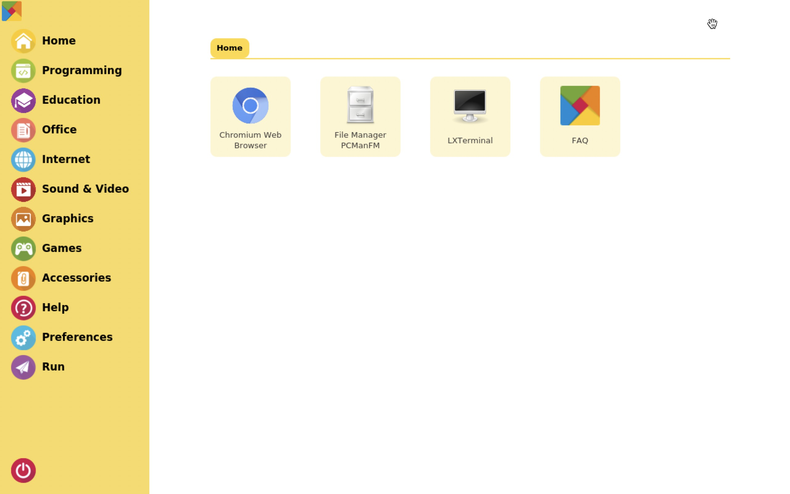

# RasPad Launcher

- [RasPad Launcher](#raspad-launcher)
  - [Introduction](#introduction)
    - [Why we abandon RasPad OS and launch RasPad Launcher](#why-we-abandon-raspad-os-and-launch-raspad-launcher)
  - [Installation Guide](#installation-guide)
  - [Rebuild guide](#rebuild-guide)

## Introduction

RasPad Launcher is an open source software, simulating a launcher menu, focus on improving touch experience with RasPad, or other touchscreen.



### Why we abandon RasPad OS and launch RasPad Launcher

RasPad OS intergrated with RasPad Launcher, RasPad FAQ with our custom UI and boot animations, which is redundant. And people loves the idea of RasPad Launcher, so we decided to remove all unnecessary components, and keep RasPad Launcher as a single app. So people can install it your own Raspberry Pi OS.

## Installation Guide

Checkout [Installation Guide](docs/installation-guide.md)

## Rebuild guide

Install build dependencies

```bash
sudo apt install -y qt5-default qt5-qmake qtbase5-dev qtbase5-dev-tools qttools5-dev qtdeclarative5-devqml-module-qt-labs-folderlistmodel qml-module-qtquick-layouts qml-module-qtquick-controls2 qml-module-qtquick-window2 qml-module-qtquick2 qml-module-qtgraphicaleffects libqt5quickcontrols2-5 libqt5quicktemplates2-5 qml-module-qtquick-templates2
```

Make

```bash
qmake
make
```

And there you go.
