# RasPad Launcher

- [RasPad Launcher](#raspad-launcher)
  - [Introduction](#introduction)
    - [Why we abandon RasPad OS and launch RasPad Launcher](#why-we-abandon-raspad-os-and-launch-raspad-launcher)
  - [Installation Guide](#installation-guide)
    - [Download Package](#download-package)
    - [Method 1: Quick install with a script](#method-1-quick-install-with-a-script)
    - [Method 2: Manually install](#method-2-manually-install)
      - [Install RasPad Launcher](#install-raspad-launcher)
      - [Replace Menu with RasPad Launcher](#replace-menu-with-raspad-launcher)
      - [Other Options](#other-options)
        - [Matchbox keyboard](#matchbox-keyboard)
        - [Display Auto rotator](#display-auto-rotator)
  - [Uninstallation Guide](#uninstallation-guide)
    - [Quick uninstall script](#quick-uninstall-script)
    - [Uninstall manually](#uninstall-manually)
      - [Delete Qt runtime](#delete-qt-runtime)
      - [Remove raspad launcher](#remove-raspad-launcher)
      - [Change menu back](#change-menu-back)
      - [Uninstall matchbox-keyboard](#uninstall-matchbox-keyboard)
      - [Uninstall screen auto rotator](#uninstall-screen-auto-rotator)

## Introduction

RasPad Launcher is an open source software, simulating a launcher menu, focus on improving touch experience with RasPad, or other touchscreen.

### Why we abandon RasPad OS and launch RasPad Launcher

RasPad OS intergrated with RasPad Launcher, RasPad FAQ with our custom UI and boot animations, which is redundant. And people loves the idea of RasPad Launcher, so we decided to remove all unnecessary components, and keep RasPad Launcher as a single app. So people can install it your own Raspberry Pi OS.

## Installation Guide

### Download Package

Download RasPad Launcher package, and extract it.

```bash
wget https://github.com/raspad-tablet/raspad-launcher/releases/download/v1.4/raspad-launcher.zip
unzip raspad-launcher.zip
cd raspad-launcher
```

### Method 1: Quick install with a script

If you don't really know what's going on, and don't care about messing up your own settings, like a brand new Raspbian. Or you are lazy enought to manual install everything, you can use the quick install script. The script will install these things:

- Qt runtime
- RasPad launcher with desktop profile
- RasPad FAQ desktop profile (Just a quick icon to browser RasPad FAQ webpage)
- display auto rotate for Accl SHIM

Run install script

```bash
chmod +x install
sudo ./install
```

### Method 2: Manually install

With manually install, you can choose what you need to install, where you want it to be and more

#### Install RasPad Launcher

Copy the pre compiled Qt runtime. It MUST be in `/usr/local/qt5pi`, or else the bin won't be able to find it.

```bash
# wget https://sunfounder.s3.us-east-1.amazonaws.com/others/qt5pi.zip
wget https://github.com/raspad-tablet/qt5pi/releases/download/v1.0/qt5pi.zip
unzip qt5pi.zip
sudo cp -r ./qt5pi /usr/local/qt5pi
```

> You don't need this if you are just upgrading.

Copy RasPad Launcher related files including binary file, desktop profile, icon, raspad-launcher-helper and raspad-faq desktop profile.

```bash
sudo cp ./applications/raspad-launcher.desktop /usr/share/applications/
sudo cp ./applications/raspad-faq.desktop /usr/share/applications/
sudo cp ./icons/raspad.png /usr/share/icons/
sudo cp ./bin/raspad-launcher /usr/local/bin/
sudo cp ./bin/raspad-launcher-helper /usr/local/bin/
sudo chmod +x /usr/local/bin/raspad-launcher
sudo chmod +x /usr/local/bin/raspad-launcher-helper
```

> raspad-launcher-helper is a simple script to make raspad launcher work like a normal menu.
> raspad-faq is a simple desktop profile to open RasPad FAQ wabpage in Chromium browser.

#### Replace Menu with RasPad Launcher

Right click on the top panel, and choose **Add/Remove Panel Items**
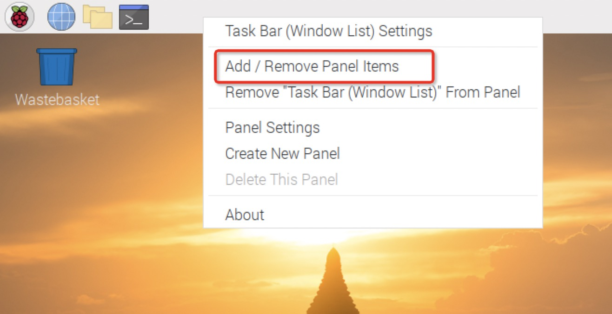

Then, click **Add** to add a new item
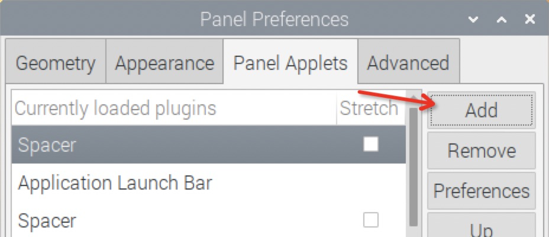

On the popup window **Add plugin to panel**, choose **Application Launch Bar** and click **Add**
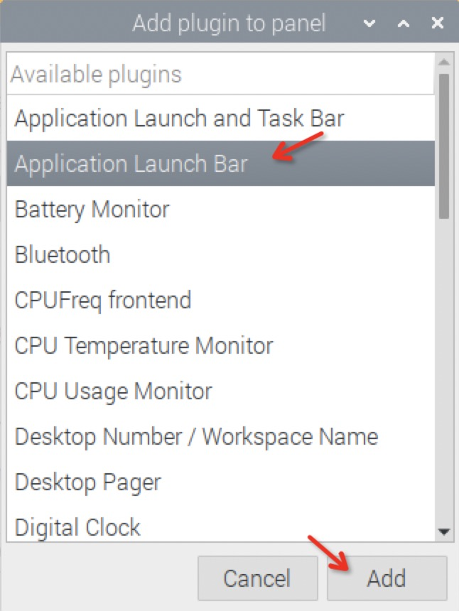

The **Application Launch Bar** will be added on the bottom, click **Up** mutiple times to move it to the top
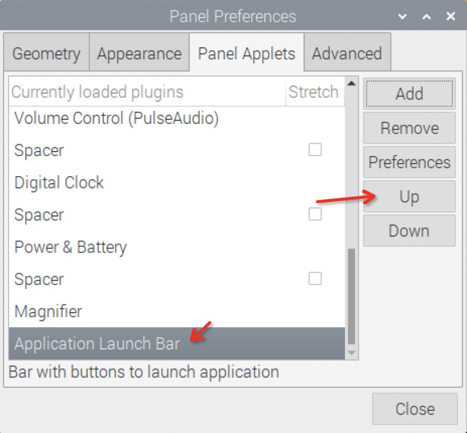

Now click **Preferences** to add RasPad Launcher
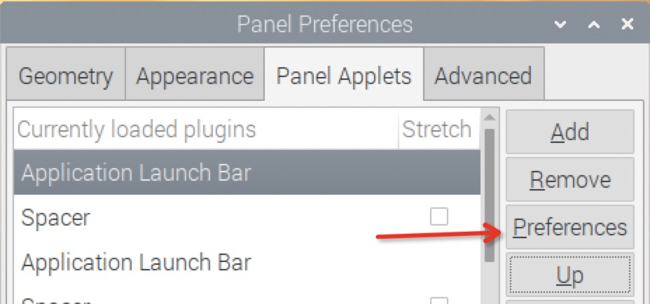

In popup window, choose **Other** on the right, and choose **RasPad launcher**, click **Add**, RasPad Launcher will appear on the left. then click **Close** to close the window.
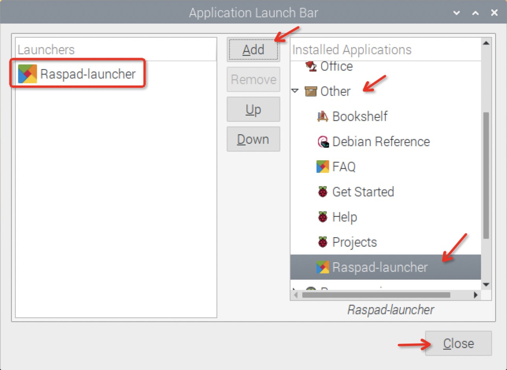

In Panel Preferences,Choose first item **Menu**, and click **Remove** on the right to remove the original menu
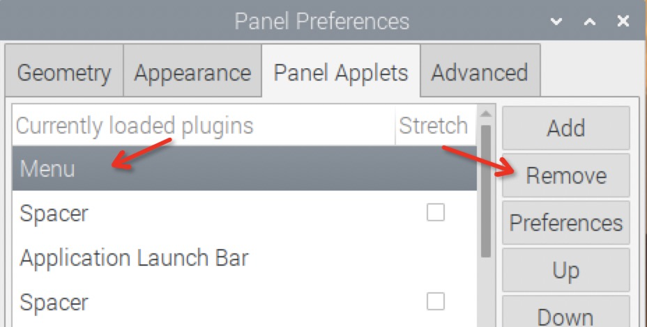

Now it's done, click Close, close the window. You can see the RasPad icon on the top left cornor
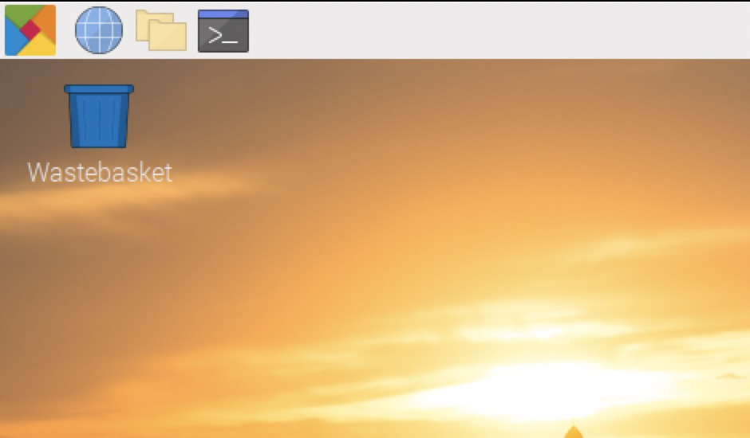

> Removing **menu** will cause some problem. like Application bar preferences will stuck for some reason. So you need to remove menu last.

#### Other Options

Here's something you might want to install.

##### Matchbox keyboard

A simple keyboard for touchscreen, not great, but good enought to use.

```bash
sudo apt install matchbox-keyboard
```

##### Display Auto rotator

The display auto rotator for Accl SHIM

```bash
git clone --depth=1 https://github.com/sunfounder/python-sh3001
cd python-sh3001
sudo python3 install.py
cd ..
```

## Uninstallation Guide

If somehow you don't want RasPad Launcher anymore, here's how you uninstall it.

### Quick uninstall script

If you install with the quick install script, youcan simply run the uninstall script to un install it.

```bash
cd raspad-launcher
chmod +x uninstall
sudo ./uninstall
```

### Uninstall manually

#### Delete Qt runtime

```bash
sudo rm -rf /usr/local/qt5pi
```

#### Remove raspad launcher

```bash
sudo rm -rf /usr/share/applications/raspad-faq.desktop
sudo rm -rf /usr/share/applications/raspad-launcher.desktop
sudo rm -rf /usr/share/icons/raspad.png
sudo rm -rf /usr/local/bin/raspad-launcher
sudo rm -rf /usr/local/bin/raspad-launcher-helper
```

#### Change menu back

Right click on the top panel, and choose **Add/Remove Panel Items**


Choose **Application Bar** and click **Remove**
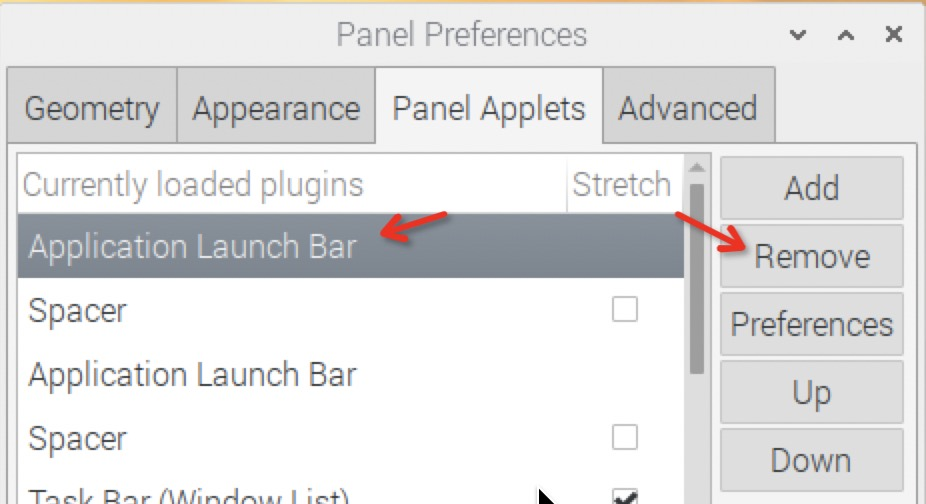

Then, click **Add** to add a new item


Scroll down, choose **Menu** and click **Add**
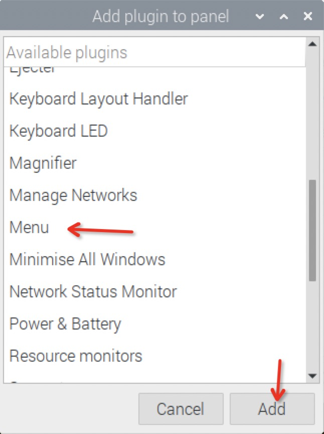

Click **Up** multiple times to move **Menu** to the top
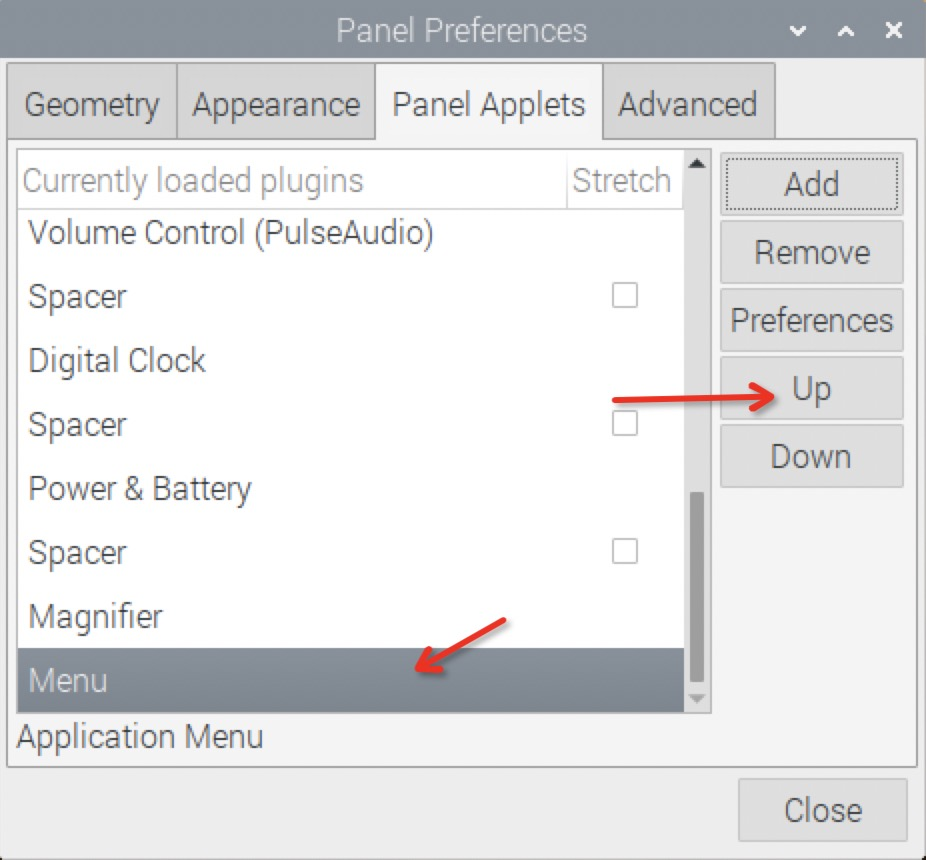

Click **Preference** to change the icon
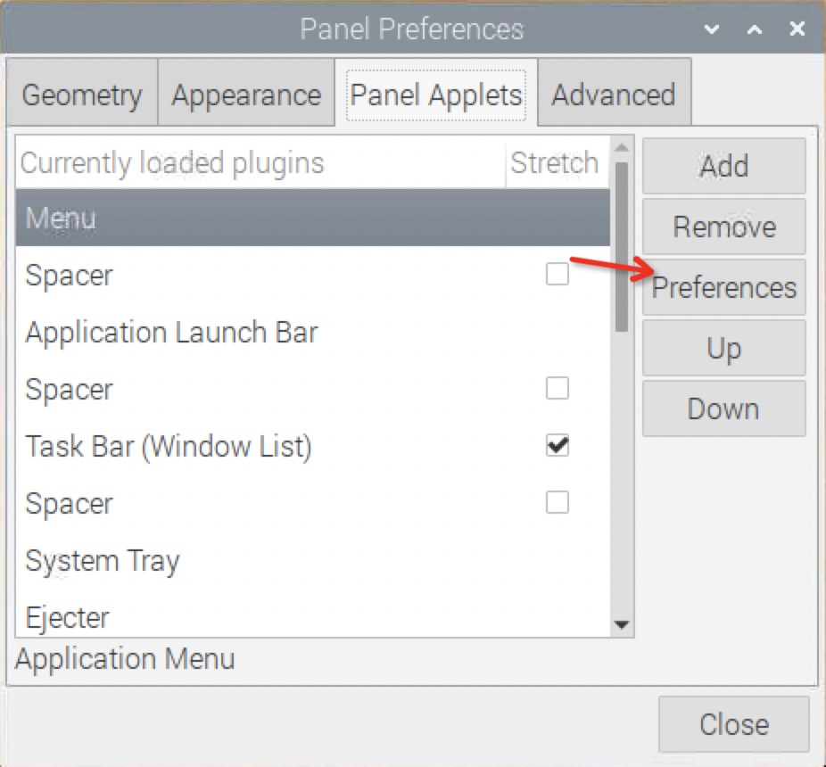

Under Icon, replace all content with "start-here", and click **OK**
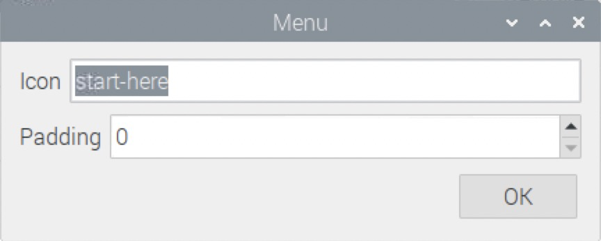

Click close and it's Done.

#### Uninstall matchbox-keyboard

```bash
sudo apt purge matchbox-keyboard
```

#### Uninstall screen auto rotator

```bash
sudo pip3 uninstall sh3001
sudo rm -rf /usr/bin/rotate-helper
sudo rm -rf /home/pi/.config/auto-rotator
```
